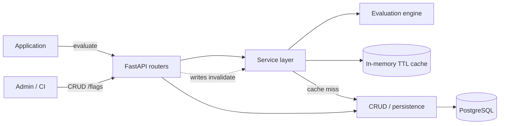
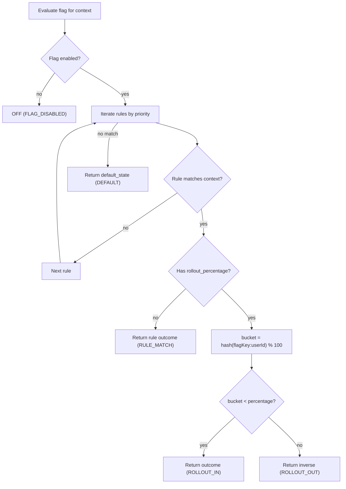
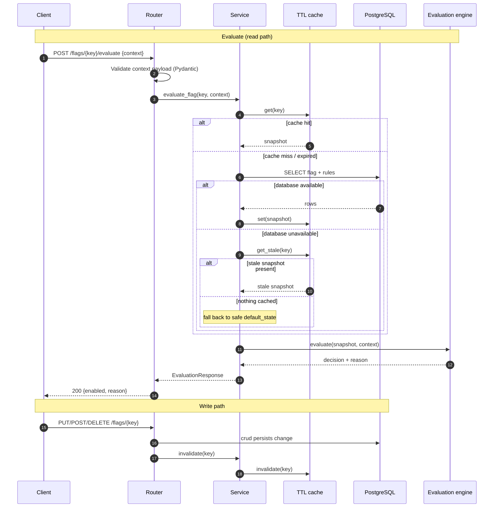

# Feature Flag Service

A production-ready REST API for storing feature flags and evaluating them against a
request-time user context. Supports rule-based contextual targeting, an in-memory
cache on the evaluation hot path, and deterministic percentage rollouts.

Built with FastAPI, SQLAlchemy 2.0 (async), PostgreSQL, and Alembic.

## Features

- Flag CRUD with named flags, a global kill-switch, a default state, and ordered rules
- Contextual evaluation: decisions are based on context attributes (e.g. `userId`,
  `subscriptionTier`, `region`), not just a global toggle
- In-memory TTL cache with read-through and write-invalidation, so evaluation never
  hits the database per request
- Deterministic percentage rollout via stable hashing of `flagKey:userId`
- Validation and a consistent JSON error envelope
- Structured JSON logging, Prometheus `/metrics`, optional OpenTelemetry tracing
- Graceful shutdown, health/readiness probes
- Unit + integration tests, GitHub Actions CI, Dockerfile, and Makefile

## Architecture

Two request paths flow through the same router:

- **Evaluate** (`App`): router → service → read-through cache → (on miss) CRUD → DB, then the evaluation engine.
- **CRUD** (`Admin`): router → CRUD → DB, and writes call the service to invalidate the cache.



### Evaluation flow



### Request lifecycle

The sequence below maps a request end to end across the caching and storage
layers, including the read-through path, write-invalidation, and the graceful
fallback when the database is unavailable.



## Project layout

```
app/
  main.py            # app factory, middleware, lifespan, /metrics
  config.py          # pydantic-settings
  db.py              # async engine/session
  models.py          # SQLAlchemy ORM models
  schemas.py         # Pydantic request/response models + validation
  domain.py          # immutable flag snapshots for the hot path
  cache.py           # in-memory TTL cache
  evaluation.py      # rule engine + deterministic rollout hashing
  crud.py            # data-access layer
  service.py         # cache + persistence + evaluation glue
  errors.py          # exceptions + handlers (error envelope)
  logging_config.py  # structlog setup
  telemetry.py       # OpenTelemetry + Prometheus metrics
  routers/           # flags, evaluation, health
alembic/             # migrations
tests/               # unit + integration tests
```

## Getting started

### Run with Docker Compose (recommended)

```bash
docker compose up --build
```

This starts PostgreSQL, applies migrations, and serves the API at
`http://localhost:8000`. Interactive docs: `http://localhost:8000/docs`.

### Run locally

```bash
make venv                    # python3 -m venv .venv
source .venv/bin/activate
make install                 # pip install -r requirements-dev.txt
cp .env.example .env         # adjust DATABASE_URL as needed
make migrate                 # alembic upgrade head
make run                     # uvicorn with autoreload
```

Dependencies are declared in [requirements.txt](requirements.txt) (runtime) and
[requirements-dev.txt](requirements-dev.txt) (runtime + dev/test). Tool
configuration lives in [setup.cfg](setup.cfg) (pytest, mypy) and
[ruff.toml](ruff.toml) (ruff).

## API

| Method | Path                       | Description                          |
| ------ | -------------------------- | ------------------------------------ |
| POST   | `/flags`                   | Create a flag (with rules)           |
| GET    | `/flags`                   | List flags (`limit`, `offset`)       |
| GET    | `/flags/{key}`             | Get a flag by key                    |
| PUT    | `/flags/{key}`             | Update a flag (rules replace the set)|
| DELETE | `/flags/{key}`             | Delete a flag                        |
| POST   | `/flags/{key}/evaluate`    | Evaluate one flag for a context      |
| POST   | `/evaluate/batch`          | Evaluate many flags for one context  |
| GET    | `/health`                  | Liveness                             |
| GET    | `/ready`                   | Readiness (checks the database)      |
| GET    | `/metrics`                 | Prometheus metrics                   |

### Create a flag

```bash
curl -X POST http://localhost:8000/flags \
  -H 'content-type: application/json' \
  -d '{
    "key": "new-checkout",
    "name": "New Checkout Flow",
    "enabled": true,
    "default_state": false,
    "rules": [
      { "priority": 0, "attribute": "subscriptionTier", "operator": "eq",
        "values": ["premium"], "outcome": true },
      { "priority": 1, "attribute": "region", "operator": "in",
        "values": ["EU", "US"], "outcome": true, "rollout_percentage": 25 }
    ]
  }'
```

### Evaluate a flag

```bash
curl -X POST http://localhost:8000/flags/new-checkout/evaluate \
  -H 'content-type: application/json' \
  -d '{ "context": { "userId": "u-42", "subscriptionTier": "premium", "region": "EU" } }'
```

Response:

```json
{
  "flag_key": "new-checkout",
  "enabled": true,
  "reason": "RULE_MATCH",
  "matched_rule_priority": 0
}
```

`reason` is one of `FLAG_DISABLED`, `RULE_MATCH`, `ROLLOUT_IN`, `ROLLOUT_OUT`, `DEFAULT`.

## Rules & operators

Rules are evaluated in ascending `priority` order; the first match wins. If no rule
matches, the flag's `default_state` is returned. Supported operators:

| Operator   | Meaning                                             |
| ---------- | --------------------------------------------------- |
| `eq`       | context attribute equals the single value           |
| `neq`      | context attribute does not equal the single value   |
| `in`       | context attribute is one of the values              |
| `not_in`   | context attribute is none of the values             |
| `contains` | context attribute contains any of the values        |

## Percentage rollout

A rule may carry a `rollout_percentage` (0-100). When such a rule matches, the user is
bucketed deterministically:

```
bucket = int(sha256("{flagKey}:{userId}").hexdigest(), 16) % 100
in_rollout = bucket < rollout_percentage
```

Properties:

- Deterministic: the same user always lands in the same bucket, so their experience is
  stable across requests and restarts.
- Uniform: buckets are evenly distributed, so `p` maps to roughly `p%` of users.
- Decorrelated: including `flagKey` in the hash means a user is not always in the
  "early" cohort for every flag.

A stable identifier (`userId`, `user_id`, or `id`) must be present in the context; if
it is absent, the user is treated as outside the rollout.

## Caching

Flag definitions are cached in-process as immutable snapshots with a configurable TTL
(`CACHE_TTL_SECONDS`, default 30s). Evaluation reads through the cache; any
create/update/delete invalidates the affected key so changes take effect immediately.

## Validation & graceful degradation

### Context payloads

Evaluation `context` objects are validated strictly (they are attacker-influenced
input on the hot path):

- At most 64 attributes; keys must be non-empty strings up to 128 characters.
- Values must be JSON scalars (string, number, boolean, `null`) or lists of scalars.
  Nested objects are rejected so operator matching stays well-defined.
- String values are capped at 1024 characters and lists at 100 items.

Invalid payloads return `422` with the standard error envelope.

```jsonc
// accepted
{ "context": { "userId": "u-42", "age": 30, "beta": true, "regions": ["EU", "US"] } }

// rejected (422) — nested object
{ "context": { "user": { "id": "u-42" } } }
```

### Database-unavailable fallback

Evaluation never returns a `500` just because the database is down. On a cache
miss when the database is unreachable, the service degrades gracefully:

1. If a previously cached (possibly stale) snapshot exists, it is used and the
   normal reason is returned (`feature_flag_cache_events_total{event="stale"}`).
2. Otherwise the flag resolves to the configured safe default
   (`EVALUATION_FALLBACK_ENABLED`, default OFF) with reason `DEFAULT`.

Both paths increment `feature_flag_evaluation_fallbacks_total{source="stale_cache"|"default"}`
so degraded operation is observable.

## Validation & errors

Requests are validated by Pydantic (slug keys, operator enum, `rollout_percentage`
range, unique rule priorities). All errors return a consistent envelope:

```json
{ "error": { "code": "not_found", "message": "flag 'x' not found", "details": null } }
```

Status codes: `404` unknown flag, `409` duplicate key, `422` schema validation,
`400`/`503` for bad requests / unavailable dependencies.

## Observability

- Structured JSON logs (`structlog`) with a per-request `x-request-id`
- Prometheus metrics at `/metrics` (evaluation counts, latency, cache events)
- Optional OpenTelemetry tracing (set `OTEL_ENABLED=true` and an OTLP endpoint)

## Development

```bash
make test        # run tests with coverage
make lint        # ruff
make typecheck   # mypy
make fmt         # auto-format
```

Integration tests run against `TEST_DATABASE_URL` when set (PostgreSQL in CI), and fall
back to a disposable SQLite database otherwise so the suite runs anywhere.

## Configuration

| Variable                      | Default                          | Description                     |
| ----------------------------- | -------------------------------- | ------------------------------- |
| `DATABASE_URL`                | `postgresql+asyncpg://...`       | Async SQLAlchemy database URL   |
| `CACHE_TTL_SECONDS`           | `30`                             | Flag cache TTL                  |
| `EVALUATION_FALLBACK_ENABLED` | `false`                          | Safe default when DB is down    |
| `LOG_LEVEL` / `LOG_JSON`      | `INFO` / `true`                  | Logging verbosity / format      |
| `OTEL_ENABLED`                | `false`                          | Enable OpenTelemetry tracing    |
| `OTEL_EXPORTER_OTLP_ENDPOINT` | -                                | OTLP collector endpoint         |

## License

MIT
